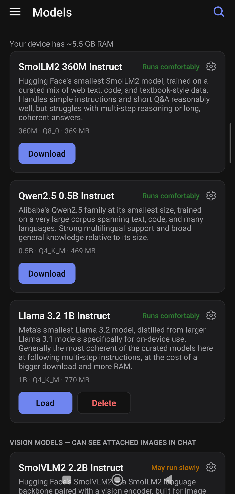
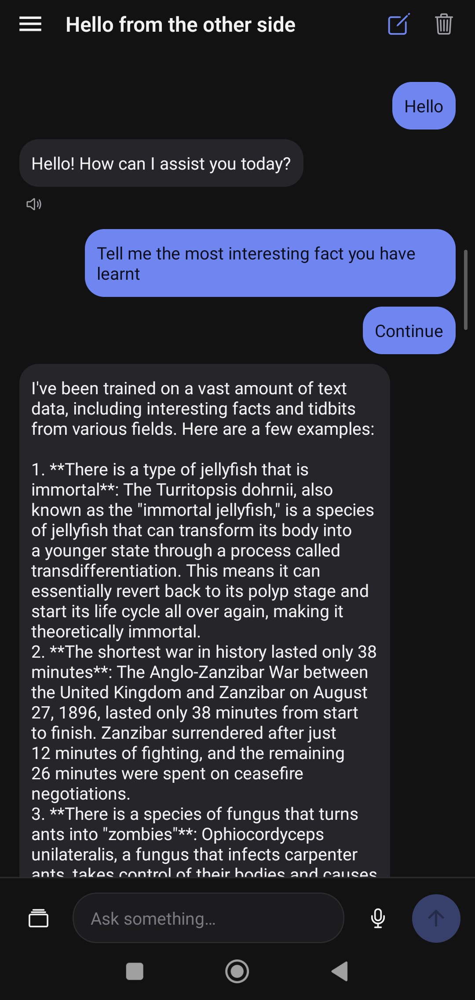
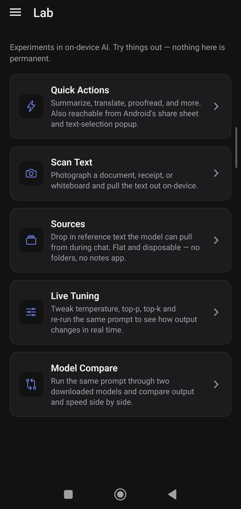
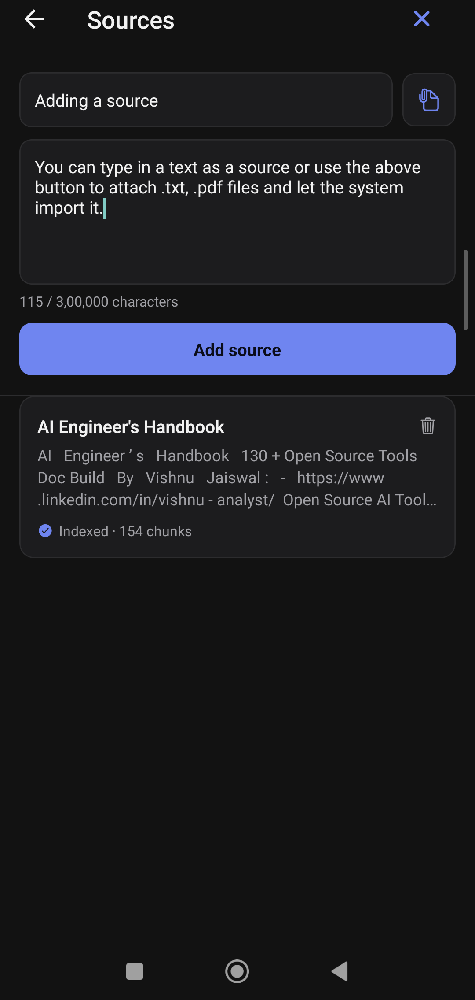
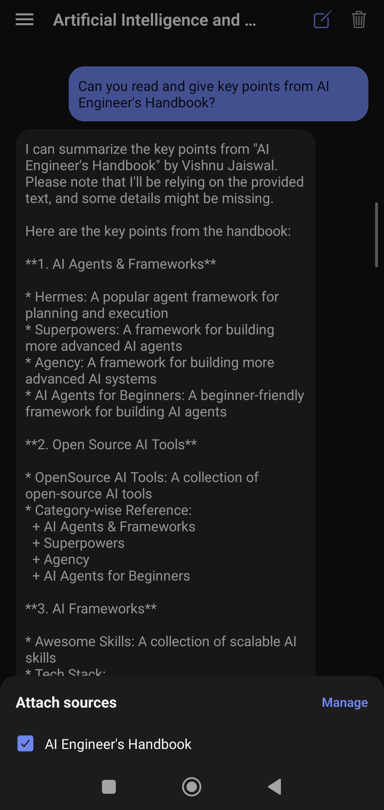

<p align="center">
  
</p>

# EdgeMind Lab

An offline-first Android app for running small LLMs entirely on-device — chat, vision,
voice, OCR, and text tools, with no network calls once a model is downloaded. Built with
React Native / Expo and [llama.rn](https://github.com/mybigday/llama.rn) so it can run on
old, low-RAM phones that can't handle typical on-device AI apps.

Everything happens locally: model inference, speech-to-text, text-to-speech, and OCR all
run on the device's own CPU. Nothing is uploaded anywhere.

## Download

**Android only, for now** — there's no iOS build.

| | |
|---|---|
| **Latest APK** | [⬇️ Download app-release.apk](https://github.com/DeepCoomer/edgemind-lab/releases/latest/download/app-release.apk) |
| **Release notes / changelog / checksum** | [Releases page](https://github.com/DeepCoomer/edgemind-lab/releases/latest) |

The download link always points at whatever the newest release is — no need to hunt through version numbers.

> [!WARNING]
> This is a personal side project, not a Play Store app — it's signed with a
> self-generated key, not reviewed by Google, and Android will warn you about
> installing an app from an unknown source. Only install it if you trust the
> source (i.e., you got it from this repo's Releases page) and understand
> what that means. Verify the download's SHA-256 checksum against the value
> listed on the release page before installing if you want extra assurance.
>
> The app needs real device storage and RAM for downloaded models (several
> hundred MB to a few GB each) and runs inference on the CPU — expect it to
> be slow and to drain battery on older/low-RAM phones, which is the exact
> hardware it targets.

## Screenshots

<table>
  <tr>
    <td align="center" width="33%">
      <br>
      <sub>Curated models with per-device RAM compatibility hints</sub>
    </td>
    <td align="center" width="33%">
      <br>
      <sub>Chat, with TTS and voice input</sub>
    </td>
    <td align="center" width="33%">
      <br>
      <sub>Lab — on-device AI experiments</sub>
    </td>
  </tr>
  <tr>
    <td align="center" width="33%">
      <br>
      <sub>Sources — reference text/PDFs for chat</sub>
    </td>
    <td align="center" width="33%">
      <br>
      <sub>Chat answering from an attached source</sub>
    </td>
    <td align="center" width="33%">
      <br>
      <sub>Launch splash screen</sub>
    </td>
  </tr>
</table>

## Features

- **Chat** — conversations with any downloaded GGUF model, streaming responses, per-chat
  model selection (no silent default-loading when you have several models downloaded).
- **Vision** — attach a photo and ask questions about it, using a multimodal model
  (SmolVLM2) with an on-device vision encoder.
- **Voice input** — dictate messages via an on-device Whisper model
  ([whisper.rn](https://github.com/mybigday/whisper.rn)).
- **Text-to-speech** — have assistant replies read aloud.
- **Scan Text (OCR)** — photograph a document, receipt, or whiteboard and extract the
  text on-device (Google ML Kit).
- **Quick Actions** — summarize, translate, proofread, rewrite, extract key points, or
  ask questions about pasted or shared text. Also reachable from Android's share sheet
  and text-selection popup.
- **Sources** — drop in reference text (including PDFs) for the model to pull from during
  chat.
- **Live Tuning** — a parameter playground to tweak temperature/top-p/top-k/max tokens
  against the same prompt and see the effect in real time.
- **Model Compare** — run one prompt through two downloaded models side by side and
  compare output and speed (tokens/sec, timing).
- **Model management** — a curated catalog of small, phone-friendly models plus search
  and download of arbitrary GGUF models from Hugging Face, with RAM-compatibility hints
  per model.

## Tech stack

- [Expo](https://expo.dev) SDK 57, React Native 0.86, TypeScript, [expo-router](https://docs.expo.dev/router/introduction/)
- [llama.rn](https://github.com/mybigday/llama.rn) — on-device LLM inference (text +
  multimodal), built on `llama.cpp`
- [whisper.rn](https://github.com/mybigday/whisper.rn) — on-device speech-to-text, built
  on `whisper.cpp`
- `expo-speech` — text-to-speech via the OS engine
- `@react-native-ml-kit/text-recognition` — on-device OCR
- `pdfjs-dist` — PDF text extraction for Sources
- New Architecture (Fabric/TurboModules), required by `llama.rn`

## Getting started

Requires Node.js, a JDK, and the Android SDK/NDK set up for React Native (this project
uses native modules, so it can't run in Expo Go).

```bash
npm install
npm run android   # builds and launches on a connected device/emulator
```

To build a signed release APK, generate a keystore and a `keystore.properties` file at
the project root (see `android/app/build.gradle` for the expected keys: `storeFile`,
`storePassword`, `keyAlias`, `keyPassword`), then:

```bash
npx expo prebuild
cd android && ./gradlew assembleRelease
```

The signed APK is written to `android/app/build/outputs/apk/release/app-release.apk`.

## Project layout

- `app/` — expo-router screens (chat, model management, Quick Actions, Lab experiments)
- `src/lib/` — model loading, download management, chat storage, audio recording, OCR,
  TTS, Whisper transcription
- `src/constants/models.ts` — the curated model catalog
- `src/components/`, `src/screens/`, `src/hooks/` — shared UI
- `plugins/` — a config plugin registering Android's `PROCESS_TEXT` intent, so the app
  appears in the system text-selection popup

## Status

Personal-use project — built for running on old/low-spec Android hardware, not
distributed via the Play Store. Android only; no iOS build exists yet. See
[LICENSE](LICENSE) (MIT).
